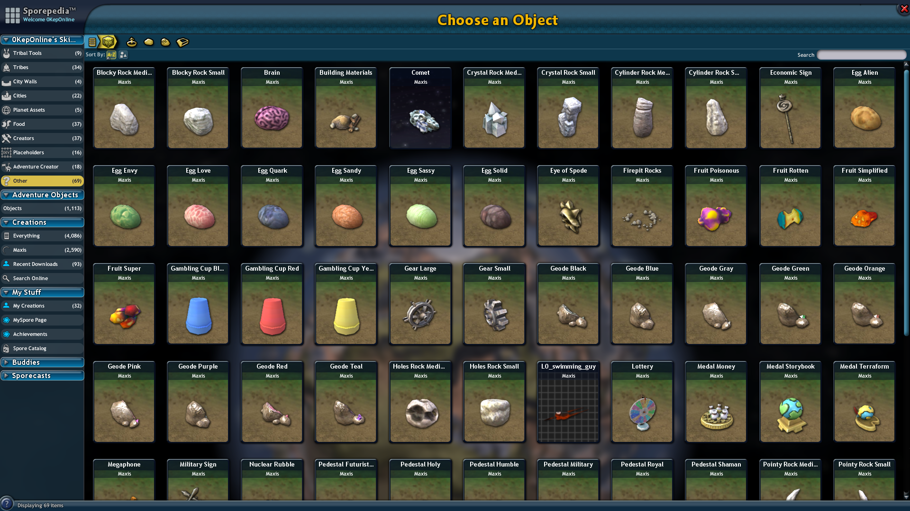

# 0KepOnline's Skinning Objects Pack

This mod adds a lot of objects to the Adventure Editor. You can use them on gameplay objects in disguise mode.

All the adventures made with it are share-safe.

** This mod requires [Universal Property Enhancer](https://github.com/Zarklord/UniversalPropertyEnhancer) to be installed.**

## Credits
 * [0KepOnline](https://github.com/0KepOnline)	(experimenting with disguising objects and creating this mod)
 * [Liskomato](https://github.com/Tenderi4)		(adding Finnish localization)
 * PoliceOfficer07	(adding German localization)
 * [A-xesey](https://github.com/A-xesey)	(creating some stub images)

Special thanks to:
 * [emd4600](https://github.com/emd4600)	(creating [SporeModder FX](https://github.com/emd4600/SporeModder-FX) and [SporeMod API](https://github.com/emd4600/Spore-ModAPI), adding Spanish localization)
 * [Zarklord](https://github.com/Zarklord)	(creating [Universal Property Enhancer](https://github.com/Zarklord/UniversalPropertyEnhancer))
